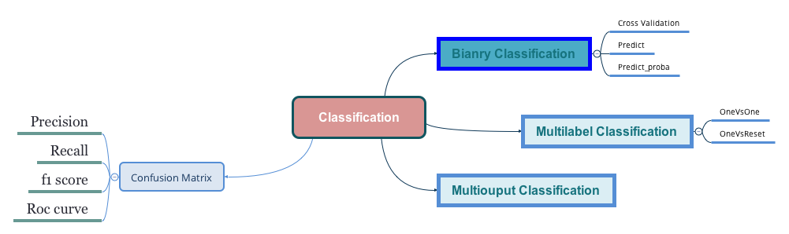

#


# 1 Confusion Matrix

```py
from sklearn.metrics import confusion_matrix
confusion_matrix(y_train, y_prediction)
```

| | _Predict\(Positive\)_ | _Predict\(Negative\)_ |
| :---: | :---: | :---: |
| _Actual\(Positive\)_ | **TP**\(True Positive\) | **FP**\(False Positive\) |
| _Actual\(Negative\)_ | **FN**\(False Negative\) | **TN**\(True Negative\) |

* Precision

$$precision=\frac{TP}{TP+FP}$$

* Recall

$$recall=\frac{TP}{TP+FN}$$

```py
from sklearn.metrics import precision_score, recall_score
precision_score(y_train, y_pred)
recall_score(y_train, y_pred)
```

* F1 Scores

$$f_1=\frac{2}{\frac{1}{precision}+\frac{1}{recall}}$$

# 2 Decision Score

```py
from sklearn.model_selection import cross_val_predict
y_scores = cross_val_predict(sgd_clf, X_train, y_train, cv=3, method='decision_function')
# or
y_scores = cross_val_predict(forest_clf, X_train, y_train, cv=3, method='predict_proba')
```

# 3 Roc Curve

```py
from sklearn.metrics import roc_curve, roc_auc_score
fpr, tpr, threshold = roc_curve(y_train, y_predict)
roc_auc_score(y_train, y_predict)
```

# 4 Multilabel or Multioutput Classification

```py
y_train_large = (y_train >= 7)
y_train_odd = (y_train == 1)
y_multilabel = np.c_[y_train_large, y_train_odd]
forest_clf.fit(X_train, y_mulitlabel)
```


