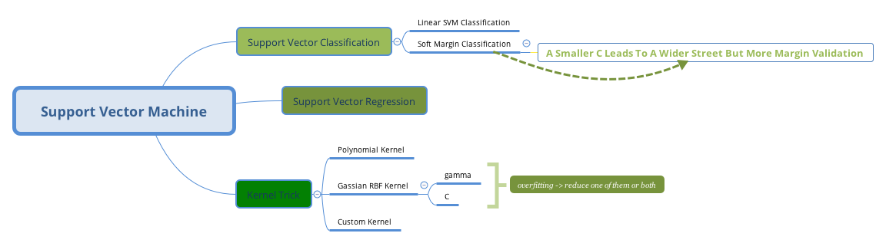

# 1 Linear SVM Classification

If your dataset is linearly separable, you should choose _LinearSVC_ in Scikit Learn. That method complexity is $$O(m\times n)$$.

```py
from sklearn.pipeline import Pipeline
from sklearn.preprocessing import StandardScaler
from sklearn.svm import LinearSVC
svm_clf = Pipeline([
('scaler', StandardScaler()),
('linear_svc', LinearSVC(C=1, loss='hinge'),
]
)
svm_clf.fit(X_train, y_train)
```

Before train your estimator, you had better scaler features. Because SVM algorithm try to find the largest **street **between different classes. it will neglect unimportant features.

# 2 Soft Margin Classification

A smaller C leads to a wilder street but more margin validation. So the model will generalize better.

# 3 Kernel Tricks

The fantastic topic of SVM algorithm is \_kernel tricks, \_which can handle linearly separable datasets.

## 3.1 Polynomial Kernel

```py
from sklearn.svm import SVC
poly_kernel_svm = Pipeline([
("scaler", StandardScaler()),
('svm_clf', SVC(kernel='poly', degree=3, coef0=1, C=5)
]
)
poly_kernel_svm.fit(X_train, y_train)
```

## 3.2 RBF Kernel

$$\phi\gamma(x, \ell)=exp(-\gamma|x-\ell|^2)$$

Create a landmark at the location of each and every instance in the datasets.

```py
rbf_kernel_clf = Pipeline([
('scaler', StandardScaler()),
('svm_clf' SVC(kernel='rbf', gamma=5, C=0.001),
]
)
```

If your model suffers from overfitting, reduce gamma, C or both.

## 3.3 Complexity

Using kernel tricks, the algorithm's complexity is usually between $$O(m^2 \times n)$$ and $$O(m^3 \times n)$$.

# 4 SVM Regression

Fit as many as possible on the street while limiting margin of violation. The width of the street is controlled by the hyperparamt

fit as many as possible on the street while limiting margin of margin violations. The width of street is controlled by a hyperparameter $$\epsilon$$.

```py
from sklearn.svm import LinearSVR
svm_reg = LinearSVR(epsilon=1.5)
svm_reg.fit(X,y)
```


# Exercise

## 1 
What is the fundamental idea bedind Support Vector Machine

*Answer*
fit the widest possible "street" between the classes.

## 2 
What's a support Vector

*Answer*
any instance located on the "stree", including the border.

## 3 
why is it important to scale the input when using SVMs

*Answer*
The small features will be neglected.

## 4 
Can an SVM Classifier output a confidence score when it classifiers an instance? what about a probability?

*Answer*
SVM can calculate the distance between the test instance and the decision boundary. But it cannot be directly
convert into an estimation of class probability.

## 5 
Should you use the primal or dual form of the SVM problem to train a model on the training
set with millions of instance and hundred features?

*Answer*
kernel trick can only use the dual form. if you have millions of instances, you had better choose
the primal form.

## 6
Say you train an SVM classifier with an RBF kerenl. It seems to underfit the training set: should you 
increase or decrease gamma? What about about C?

*Answer*
increase gamma or C (or both)

## 7
How should you set the QP Parameter(H, f, A and b) to slove the soft margin linear SVM classifier problem using an off-the-shlef QP slover?


## 9 & 10
See Exercise.ipynb