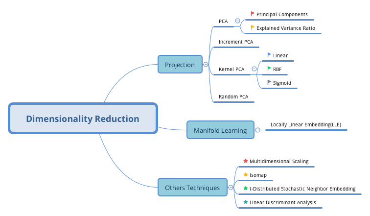

# Exercise

## 1
What are the main motivations for reducing a dataset's dimensionality? What are the main drawbacks?

- motivations
    - speed up the training algorithm
    - visualization
    - save space

- drawbacks
    - information lost
    - hard to interpret
    - add complexity

## 2 
What is the curse of dimensionality?

overfit training dataset

## 3
Once a datasets dimensionality has been reduced, is it possible to reverse the operation? If so, how?
If not, why?

## 4
Can PCA be used to reduce the dimensionaltiy of a high nonlinear datasets?

No, because you may loss information when you conduct the dimensional reduction

## 5
Suppose you perform PCA on a 1000-dimensional dataset, setting the explained variance ratio to 95%. How many dimensionns will the resulting dataset have?

hard to say, it depends on dataset.

## 6
In what case would you use vanilla PCA, Incremental PCA, Randomized PCA, or Kernel PCA?

- Vanilla PCA: the dataset fit in memory
- Incremental PCA: larget dataset that don't fit in memory, online taks
- Randomized PCA: considerably reduce dimensionality and the dataset fit the memory.
- kenrl PCA: used for nonlinear PCA

## 7
How can you evaluate the performance of a dimensionality reduction algorithm on your dataset?

- measure the reconstruction error
- measure the performance in second Machine Learning algorithm

## 8 
Does it make any sense to chain two different dimensionality algorithms?

Yes