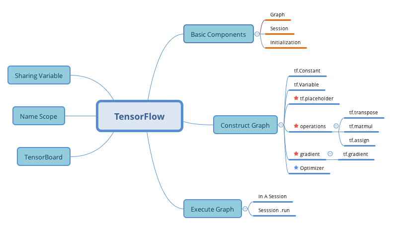

# Exercise

1. What are the main benifits of creating a computation graph rather than directly executing the computation? What are the main drawbaks?

2. Is the statement `a_val = a.eval(session=sess)` equivalent to `a_val = sess.run(a)` ?

3. Is the statement `a_val, b_val = a.eval(session=sess), b.eval(session=sess)` equivalent to `a_val, b_val=sess.run([a, b])`?

4. Can you run two graph in the same session?

5. If you create a graph g containing a variable w, then start two threads and open a session in each thread, both using the same graph g, will each session have its own copy of teh variable w or will it be shared?

6. When is a variable initialized? when is it destroyed?

7. What is the difference between a placeholder and a variables?

8. What happens when you run the graph to evaluate an operation thata depends on a placeholder but you don't feed its value? What happens if the operation does not depend on the placeholder?

9. When you run a graph, can you feed the output value of any operation, or just the value of the placeholder?

10. How can you set a variable to any value you want(during the execution phase)?

11. How many times does reverse-mode autodiff need to traverse the graph in order to compute the gradients of the cost function with regards to 10 variables? What about forward-mode autodiff? And symbolic differentitaion?