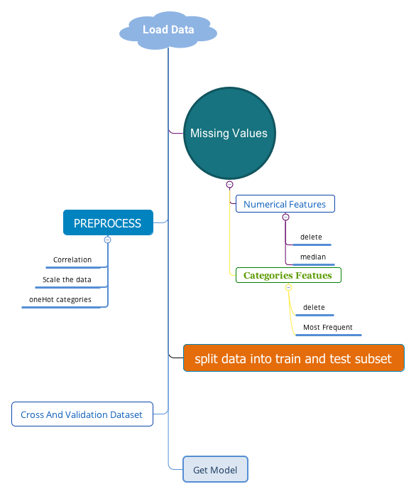

# 1 Preprocess

## 1.1 Overview

* Categorical Statistis

```py
housing['ocean_proximity'].value_counts()
```

* Histogram

```py
import matplotlib.pyplot as plt
housing.hist(bins=50, figsize=(20,15))
plt.show()
```

* Visualization

```py
housing.plot(kind='scatter', x='longitude', y='latitude', alpha=0.1)
```

* Correlation

```py
corr_matrix = housing.corr()
corr_matrix['median_house_value'].sort_values(ascending=True)
# more visualization
from pandas.tools.plotting import scatter_matrix
attributes = ['median_housing_value', 'median_income', 'total_rooms'
,'housing_median_age']
scatter_matrix(housing[attributes], figsize=(12,8))
```

## 1.2 Split dataset

```py
from sklearn.model_selection import split_train_test
X_train, X_test, y_train, y_test = split_train_test(X, y, test_size=0.2, random_state=42)
```

## 1.3 Missing values and standard

* Numerical features

```py
from sklearn.preprocessing import Imputer
imputer = Imputer(strategy='median')
X_train = imputer.fit_transform(X_train)
# standard
from sklearn.preprocessing import StandardScaler
scaler = StandardScaler()
X_train = scaler.fit_transform(X_train)
```

* Categorical features

```py
from sklearn.preprocessing import LabelBinarizer
encoder = LabelBinarizer()
X_train_cat = encoder.fit_transform(X_train_cat)
```

## 1.4 Pipelined

```py
num_pipeline = Pipeline([
('selector', DataFrameSelector()),
('imputer', Imputer()),
('std_scaler', StandardScaler())
])
cat_pipeline = Pipeline([
('selector', DataFrameSelector()),
('label_binarizer', LabelBinarizer()),
])
full_pipeline = FeatureUnion(transform_list=[
('num_pipeline', num_pipeline),
('cat_pipeline', cat_pipeline),
])
X_train = full_pipeline.fit_transform(housing)
```

# 2 Grid search

```py
from sklearn.model_selection import GridSearchCV
from sklearn.ensemble import RandomForestRegressor
param_grid = [
{'n_estimators':[3, 10, 30], 'max_features':[2,4,6,8]},
{'bootstrap':[False], 'n_estimaors':[3, 10], 'max_features':[2,3,4]}
]
forest_clf = RandomForestRegressor()
grid_search = GridSearchCV(forest_clf, param_grid,cv=5,
scoring='neg_mean_squared_error')
grid_search.fit(X_train, y_train)
```


