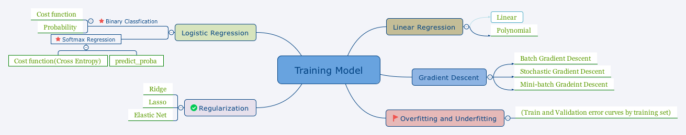

# 1 Linear Regression

$$\hat{y}=\theta^T x$$

**cost function**

$$MSE(X,h_{\theta})=\frac{1}{m}\sum_{i=1}^{m}(\theta^T-x^{(i)}-y^{(i)})^2$$

## 1.1 Normal Equation

$$\hat{\theta}=(X^T X)^{-1}X^T y$$

# 1.2 Gradient Descent

$$\nabla_{\theta}MSE(\theta)=\frac{2}{m}X^T(X\theta-y)$$

* batch gradient descent
* stochastic gradient descent
* mini-batch gradient descent

**attention: **

stochastic GD and mini-batch GD need well-designed learning rate.

```py
# mini-batch gradient descent
def fetch_batch(X, y, batch_size, seed=42):
np.random.seed(seed)
indice = np.random.randn(X.shape[0], size=batch_size)
return X[indice], y[indice]
```

## 1.3 Polynomial Regression

```py
from sklearn.preprocessing import PolynomialFeatures
poly_features = PolynomialFeatures(degree=2, include_bias=False)
X_poly = poly_features.fit_transform(X)
```

_PolynomialFeatures\(degree=d\) \_transforms an array containing \_n_ features into an array containing $$\frac{(n+d)!}{d!n!}$$ features.

# 2 Handling Overfitting and underfitting

Draw \_learning curves: \_Plot of the model's performances on the training set and the validation set as a function of train set size.

# 3 Regularized Linear Models

* Ridge

If $$\alpha$$ is very large. then all weighted end up very close to zero.

* Lasso

if $$\alpha$$ is very large, it tends to completely eliminate the weights of the least important features

* Elastic Net

Middle ground between Ridge and Lasso

# 4 Logistic Regression

## 4.1 Binary Classification

**cost function**

$$J(\theta)=-\frac{1}{m}\sum_{i=1}^{m}\big[y^{(i)}log(\hat{p}^{(i)})+(1-y^{(i)})log(1-\hat{p}^{(i)})\big]$$

**predict probability**

```python
log_reg = LogisticRegression()
log_reg.fit(X,y)
log_reg.predict_proba(X_new)
```

## 4.2 Softmax Regression

**cross entropy cost function**

$$J(\Theta)=-\frac{1}{m}\sum_{i=1}^{m}\sum_{k=1}^{K}y_k^{(i)}log(\hat{p_k}^{(i)})$$
