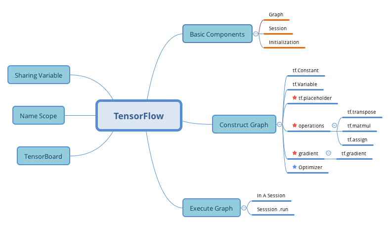

# Exercise

1. What are the main benifits of creating a computation graph rather than directly executing the computation? What are the main drawbaks?

- **Main Benefits**
    - Tensorflow can automatically compute the gradients for you
    - Tensorflow can run operations in parallel in different threads
    - Run the same model in different devices
    - Simplifies the introspection

- **Main Drawbacks**
    - make learning curve steeper
    - make step-by-step debug harder

2. Is the statement `a_val = a.eval(session=sess)` equivalent to `a_val = sess.run(a)` ?

**Yes** :
They are same.

3. Is the statement `a_val, b_val = a.eval(session=sess), b.eval(session=sess)` equivalent to `a_val, b_val=sess.run([a, b])`?

**No**:
The first graph run twice, one to compute the `a`, and another to compute the `b`.

4. Can you run two graph in the same session?

**No**: You have to merge those two graphs into one graph.

5. If you create a graph g containing a variable w, then start two threads and open a session in each thread, both using the same graph g, will each session have its own copy of teh variable w or will it be shared?

- In local Tensorflow

    Both of them using same graph `g`, and each session will have its own copy of the variable `w`. 

- In distributed Tensorflow
    Variable values are stored int containers managed by the cluster, so if both session connect to the same cluster and use the same container, then they will share same variablue value for `w`.


6. When is a variable initialized? when is it destroyed?

**Initialized**: When you call the initilizer

**Destroyed**: When the session ends

*Attention*: In distributed Tensorflow, variables live in containers on the cluster, so closing a session will not destroy the variable.


7. What is the difference between a placeholder and a variable?

**Variable:**
An operation that holds a value. If you run the variable, it returns that value. Before you can run it, you need to initialize it. You can also change the variable's value by `assignment` operation.

**Placeholder:**
They just hold information about the type and shape of the tensor they represent, but they have no value. You must feed the Tensorflow the value of the placeholder before you evaluate the operation.


8. What happens when you run the graph to evaluate an operation that depends on a placeholder but you don't feed its value? What happens if the operation does not depend on the placeholder?

Get an expection


9. When you run a graph, can you feed the output value of any operation, or just the value of the placeholder?

**Yes** you can.

10. How can you set a variable to any value you want(during the execution phase)?

```python
import tensorflow as tf
x = tf.Variable(tf.random_uniform(shape=(), minval=0.0, maxval=1.0))
x_new_val = tf.placeholder(shape=(), dtype=tf.float32)
x_assign = tf.assign(x, x_new_val)

with tf.Session():
    x.initializer.run()
    print(x.eval())
    x_assign.eval(feed_dict={x_new_val: 5.0})
    print(x.eval()) # 5.0
```

11. How many times does reverse-mode autodiff need to traverse the graph in order to compute the gradients of the cost function with regards to 10 variables? What about forward-mode autodiff? And symbolic differentitaion?

Only twice.