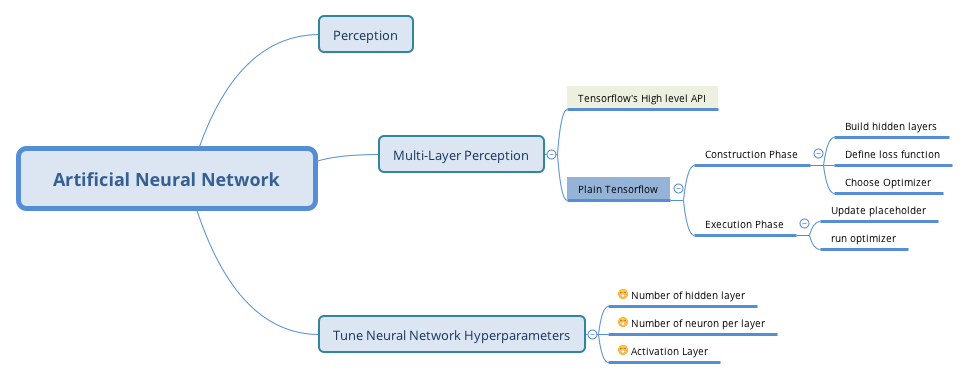
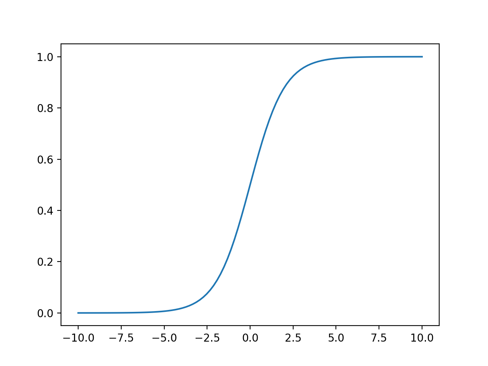
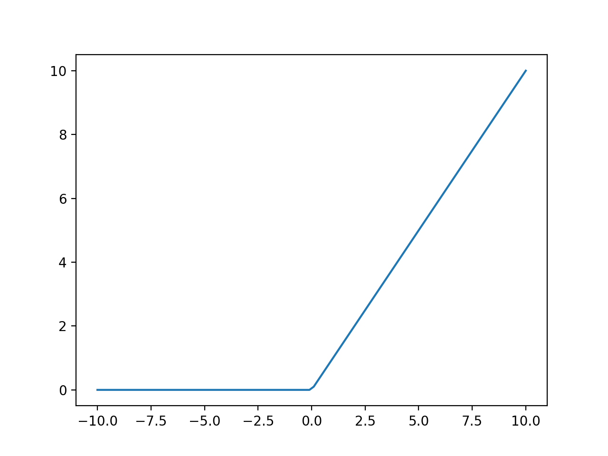
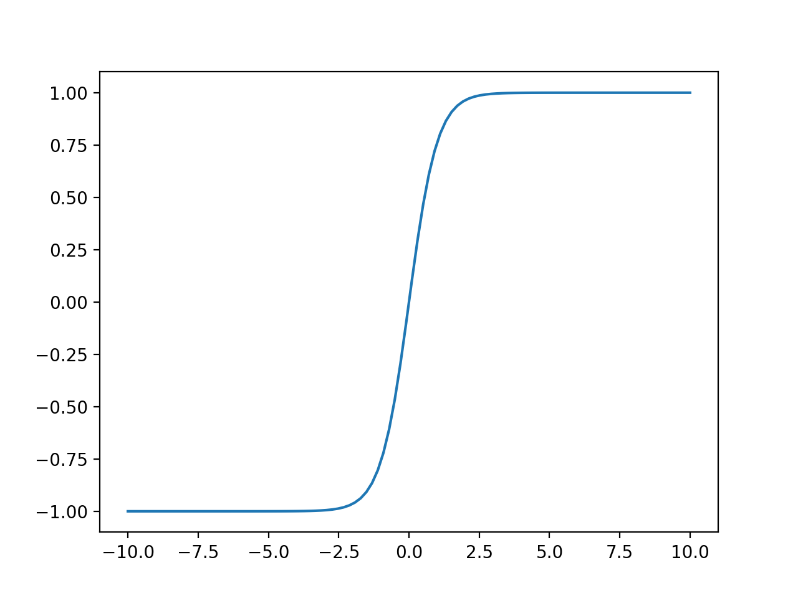

# Exercises

2. Why is it generally preferable to use a *Logistic Regression* classifier rather than a *Perception*? How can you tweak a Perception to make it equvalent to a Logistic Regression clasifier?

*Perception* do not output a class probability, it just make predictions based ont hard threshold. If you change the activation function to the logistic function. And training it using *Gradient Descent* to minimize the loss.

3. Why was the logistic activation function a key ingredient in training the first MLPs?

The Logististic function has a well-defined nonzero derivative everywhere, which allows *Gradient Descent* to make some process a every step.

4. Name three popular activition functions. Can you draw them?

- Losgistic

- Relu

- Tanh

5. Suppose you have an MLP composed of one input layer with 10 passthrough neurons, followed by one hidden layer with 50 artifical neurons, and finally one output layer with 3 artificial neurons. All artificial neurons use the `ReLU` activation functions.

- What is the shape of input matrix **X**?

m × 10

- What about the shape of hidden layer's weight vector **Wh**, and the shape of its bias vector **bh**?

**Wh:** 10 × 50

**bh:** 50 × 1

- What is the shape of the network's output matrix **Y**？

**Y:** m × 3

- Write the equation that computes the network's output matrix **Y** as a function of **X**, **Wh**, **bh**,
**Wa** and **b0**.

**Y = relu(X × Wh + bh) * Wa + b0**

6. How many neurons do you need in the output layer if you want to classify email into spam or ham? What activation function should you use in the output layer? If instead you want to tackle the MNIST, how many neurons do you need int the output layer, using what activation function? Answer the same questions for getting your network to predict housing prices as in Chapter 2?

Spam or ham : only one neuron and using logistic function

MNIST Classification: 10 neuron and using softmax function

7. What is backpropagation and how does it work? What is the difference between backpropagation and reverse-mode autodiff?

Backpropagation is a technique used toe train artificial neural networks. It first computes the gradient of the cost function with regards to every model parameters, and then it performs a *Gradient Descent* step using this gradients.

**reverse-mode autodiff** is a simply a technique to compute the gradients efficiently.

8. Can you list all the hyperparameters you can tweak in an MLP? If the MLP overfits the training data, how could you tweak thest hyperparameters to try to solve the problem?

- Number of hidden layer
- Number of neuron per layer
- Activation function.
