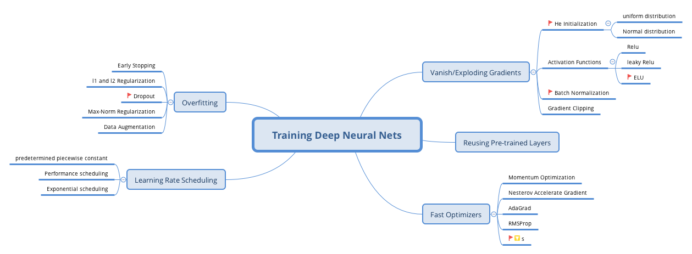

# Exercises

1. Is it okay to initialize all the weights to the same value as long as that value is selected randomly using He initialization?

No, He initialization depends on the input and output neuron's number.

2. Is it okay to initialize the bias terms to 0?
Yes

3. Name thress advantages of the ELU activation function over ReLU.

- It can take on negative values
- It always has a nonzero derivative
- It is smooth everywhere

4. In which cases would you want to use each of the following activation functions: ELU, leaky ReLU,
ReLU, tanh, logistic, and softmax?

- relu works as default
- leaky relu given a hyperparameters
- relu function
- tanh if you want to output range -1 to 1
- logistic: if you want a probability in binary classification
- softmax: multioutput classification

5. What may happen if you set the momentum hyperparameter to close to 1 (e.g. 0.99999) when you using MomentumOptimizer?

it will 10000 times faster than last epoch

6. Name Three ways you can produce a sparse model.

- l1 regularzation
- train mdoel normally
- comnien l1 regularization with *dual averaging*

7. Does dropout slow down training? Does it slow down inference(i.e. making prediction on new instance)?

Yes, dropout does slow down the training. Howerver it has no impact on th inference since it only turn on during training.
