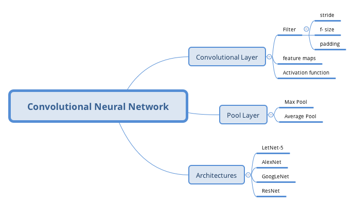

# Exercise 

1. What are the advantages of a CNN over a fully connected DNN for image classification?

- CNN's layers are only partially connnected and reuses its weights.
- learned a kernel which can detect a particular features.
- A CNN's architecture embeds this prior knowledge.

2. Consider a CNN composed of three convolutional layer, each with 3 × 3 kernels, a stride of 2, and SAME padding. The lowest layer output 100 features maps, the middle one outputs 200, and the top one outputs 400. The input images are RGB images of 200 × 200 pixels. What is the total numbers of parameters in the CNN? If we are using 32-bit floats, at least how much RAM will this network require when making a prediction for a single instance? What about when training on a mini-batch of 50 images?

**parameters**

- first convolutional layer
    kernel-size and RGB channels, plus bias: 3 * 3 * 3 + 1 = 28
    output feature maps is 100: 28 * 100 = 2800
- second convolutional layer
    kernel-size and last feature maps, plus bias: 3 * 3 * 100 + 1 = 901
    output feature maps is 200: 901 * 200 = 180200
- third convolutional layers
    kernel-size and last feautre maps, plus bias: 3 * 3 * 200 + 1 =1801
    output feautre maps is 400: 1801 * 400 = 720400

*Total parameters is* 2800 + 180200 + 720400  = 903400

**memories**
since 32-bit is 4 bytes
- first convolutional layer
    one feature map size:  100 * 150 = 15000
    total output: 15000 * 100 = 1,500,000
- second convolutional layer
    one feature map size: 50 * 75 = 3,750
    total output: 3750 * 200 = 750,000
- third convolutional layer
    one feature map size: 25 * 38 = 950
    total ouput: 950 * 400 = 380, 000

(1,500,000 + 750,000 + 380,000) * 4 / 1024 /1024 = 10.032 (MB)
903400 * 4 / 1024 / 1024 = 3.44 (MB)
10.032+ 3.44=13.47(MB)

3. If your GPU rans out of the memory while training a CNN, what are five things you could try to solve the problem?

- reduce mini-batch size
- reduce dimensionality using a larger stride in one or more layers
- remove one or more layers
- using 16-bits instead of 32-bit floats
- distributed the cnn across multiple devices

4. Why would you want to add a max pooling layer rather than a convolutional layer with the same stride?
A max pooling layer has no parameters at all, whereas a convolutional layer has quite a few.

5. When would you want to add a *local response normalization* layer?

6. Can you name the main innovations in AlexNet, compared to LetNet-5? What about the main innovations in GoogLeNet and ResNet?

- AlexNet

    - it is much larger and deeper
    - stacks convolutional layer directly on top of each convlutional layer

- GooLeNet
    - introduce a *inception modules*, which make it possible to have much deeper net than previous network

- ResNet
    - introduce a skip connection.