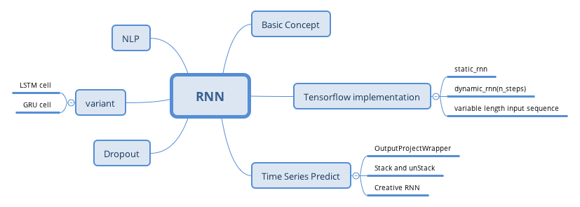

# Exercise

1. Can you think of a few applications for sequence-to-sequence RNN? What about a sequence-to-vector RNN? And a vector-to-sequence RNN?

2. Why do people use encoder-decoder RNNs rather than plain sequence-to-sequence RNNs for automatic translation?

3. How could you combine a convlutional neural network with an RNN to classify videos?

4. What can  you deal with variable-length input sequences? What about variable-length output sequences?

