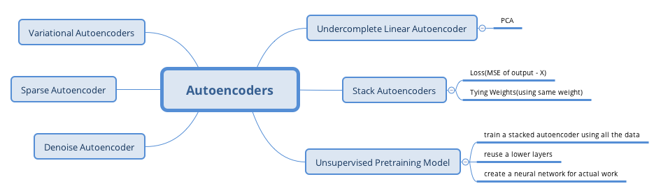

# Exercise

1. What are the main tasks that autoencoders are used for?

- Feature extraction
- Unsupervised pretraining
- Dimensionality reduction
- Generative Models
- Anomaly detection

2. Suppose you want to train a classifier and you have plenty of unlabeled training data, but only a few thousand labeled instance. How can autoencoders help? How would you proceed?

**Firstly:** train a deep autoencoder on the full dataset(labeled + unlabeled). **Then:** reuse its lower half layers. **Lastly:** train the classifier using the labeled data.

3. If an autoencoder perfectly reconstructs the inputs, is it necessarily a good autoencoders? How can you evaluate the performance of an autoencoder?

The fact that an autoencoder perfectly reconstructs its inputs does not necessarily mean that it is a good autoencoders.  It seems that it is simply an overcomplete autoencoders. 

4. What are undercomplete an overcomplete autoencoders? What is the main risk of an excessively undercomplete autoencoder? What about the main risk of an overcomeplete autoencoder?

**undercomplete** is one whose codings layer is smaller than the input and output layers.
**overcomplete** is one whose codiing layer is larger than the input and output layers.

*drawbacks*

**undercomplete** it may fail to reconstruct the inputs
**overcomplete** it just copies the inputs to the outputs

5. How do you tie weights in a stacked autoencoder? What is the point of doing so?

To tie the weights of encoder layer and its corresponding decoder layer, you simply make the decoder weights equal to the transpose of the encoder weights. It reduce the number of parameters in the model b half, often making training converge faster with less training data, and reducing the risk of overfitting the training set.

6. What is a common technique to visualize features learned by the lower layer of a stacked autocoder? What about higher layers?

To visualize the features learned by the lower layer of a stacked autoencoder, a common technique is simply to plot the weights of the each neuron, by reshaping each weight vector to the size of an input image. To visualize the features learned by higher layers, one technique is to display the training instances that most activate each neuron.

7. What is a generative model? Can you name a type of generative autoencoder?

A generative model is a model capable of randomly generating outputs that resemble the training instances. For example, once trained successfully on the MNIST dataset, a generative model can be used to ranomly generate realitic image. The output distribution  is typically similar to the training data. For example, since MNIST contains many images of each digit, the generative model would output roughly the same number of images of each digit. Some generative models can be parameterized-for example, to generate only some kinds of outputs. An example of generative autoencoder is the variational autoencoders.